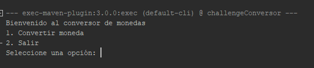
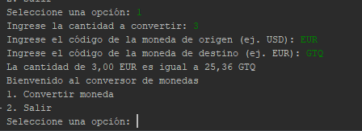
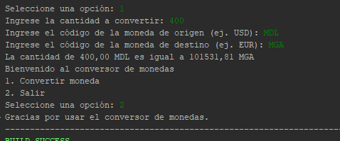

# Challenge-conversorMonedas en JAVA

Este proyecto es un conversor de monedas interactivo que utiliza la API de ExchangeRate-API para obtener tasas de cambio actuales y realiza conversiones de moneda basadas en la entrada del usuario. La aplicación está escrita en Java y utiliza `HttpClient` para realizar solicitudes HTTP y `Gson` para parsear respuestas JSON.

## Características

- Realiza solicitudes HTTP a la API de ExchangeRate-API para obtener las tasas de cambio más recientes.
- Convierte cualquier cantidad de una moneda a otra según las tasas de cambio actuales.
- Interfaz de usuario basada en consola con un menú interactivo.
- Entrada del usuario manejada mediante la clase `Scanner`.

## Requisitos

- Java 11 o superior.

## Dependencias
- Gson para el parsing de JSON.

## Resultados

